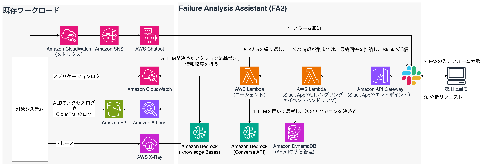
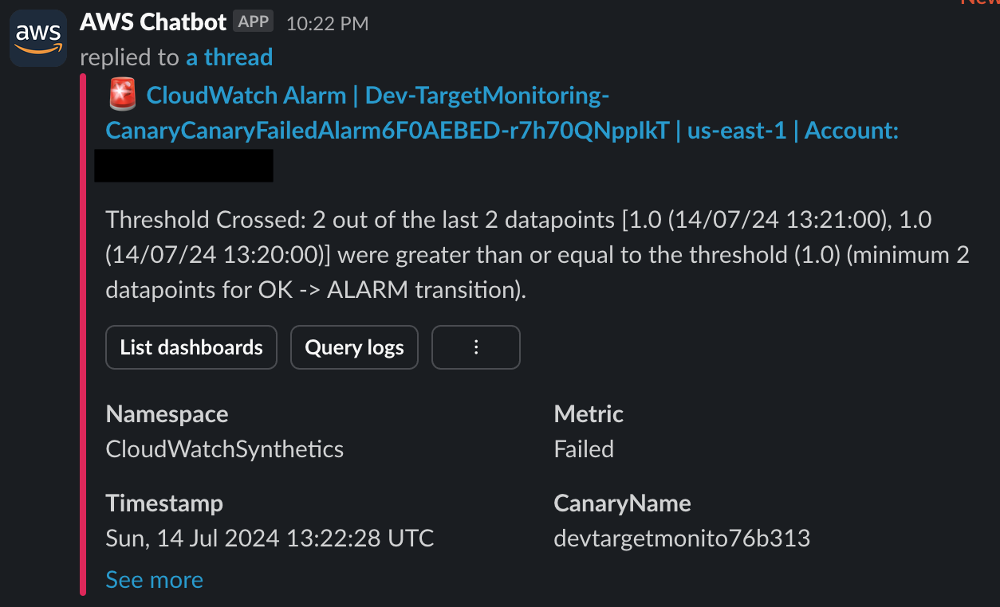
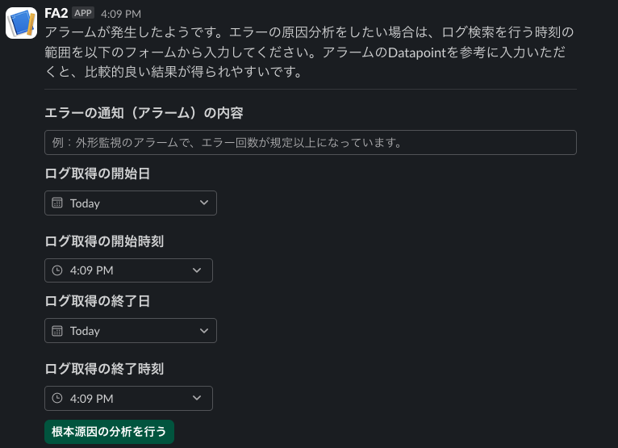
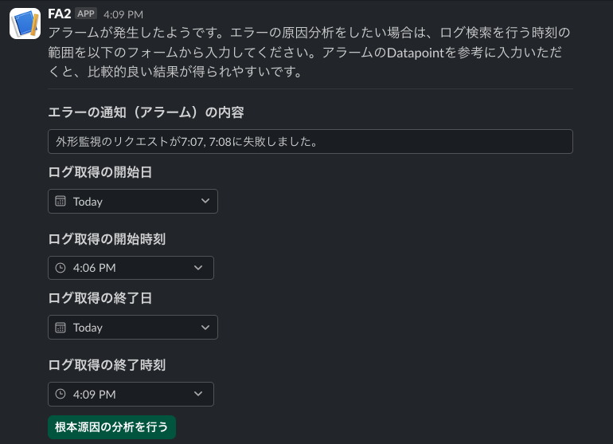
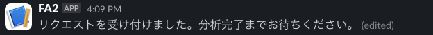
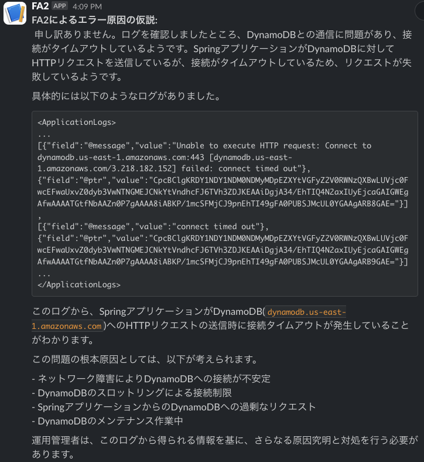

# Failure Analysis Assistant (FA2)

[View this page in English](./README_en.md)

Amazon Q Developer in chat applications が Slack に送ったアラームに反応し、エラーの根本原因を分析を支援するサンプル実装です。
参考： [AIOps で障害分析を効率化してみよう.pdf](https://pages.awscloud.com/rs/112-TZM-766/images/AIOps%E3%81%A6%E3%82%99%E9%9A%9C%E5%AE%B3%E5%88%86%E6%9E%90%E3%82%92%E5%8A%B9%E7%8E%87%E5%8C%96%E3%81%97%E3%81%A6%E3%81%BF%E3%82%88%E3%81%86.pdf)

本サンプルで試せることは以下の通りです。

**障害分析支援**

あらかじめ定義されたログの保管先から、ユーザが指定した時間範囲でログを取得し、そのログを LLM で情報抽出や要約を行い、障害分析を助ける情報を Slack に返します。
機能の動作イメージは、[障害分析支援](#障害分析支援) を参照ください。

## Branches

- [`main`](https://github.com/aws-samples/failure-analysis-assistant) - 本ブランチです。Slack App を利用したバージョンです。AWS Summit Japan 2024 ではこちらを展示しました。
- [`chatbot-customaction`](https://github.com/aws-samples/failure-analysis-assistant/tree/chatbot-customaction) - Slack App の代わりに、Amazon Q Developer in chat applications の Custom Action という機能を利用して、入力フォームを実装したバージョンです。Slack App が利用できない環境や、Slack App を管理したくない場合は、こちらをご利用ください。

## Background

これまでチャットにアラームの通知を流すような ChatOps を実装されている方々は多いのではないでしょうか。
しかし、アラームなどのイベントが発生した時、実際に時間がかかる作業は、イベント検知後に発生する、原因分析や分析結果特定後の修正です。
このソリューションでは、原因分析をできるだけ効率化するための一つのアイデアとして、LLM を利用した障害分析を示します。

通常、原因分析を行う場合は、アラームの発生時刻から、関連するログが出ているであろう一定時間の範囲を定義し、ログを取得します。
ログも一箇所ではなく、多数に散らばっているものを同様の時間範囲で取得し、それらの関係性を整理し、原因の特定を行います。
この情報処理はなかなかに根気と時間の必要な作業であり、ビジネス影響が出ているような状況ではプレッシャーもかかります。

そこで、このログ収集を効率化することができるかを考えます。
AWS の代表的なログの出力先である Amazon CloudWatch Logs は、Query を利用することで、時間範囲を指定し、ログを取得できます。Amazon S3 は Amazon Athena と組み合わせることで、同様のことが実現できます。
加えて、AWS X-Ray も時間範囲を指定することで、該当時間の範囲でトレース情報を取得できます。
ログやトレースはプログラムで取得を効率化できることがわかりました。

それでは、これら取得した情報を大規模言語モデル(Large Language Model: LLM)にインプットすることで、情報抽出や要約についても、効率化を図れないでしょうか。
LLM は、要約や情報抽出の処理が得意なことで知られています。人間よりも多くの入力情報を早い時間で処理することが可能です。
LLM の回答結果にハルシネーションが含まれる可能性はあるので注意は必要ですが、最終的に人間が判断を行うような補助的な使い方はできると考えます。

ぜひこのサンプルをご利用いただき、その効果をお試しください。

## Architecture & Workflow

既存ワークロードの範囲は、既に実装されているという前提です。
本サンプルは、CloudWatch Logs にログが出力されていれば、お試しいただけます。



1. 対象システムで、メトリクスなどに設定したアラームが発火し、Amazon SNS と Amazon Q Developer in chat applications を通じ Slack に通知が届きます
2. FA2 が通知をトリガーに入力フォームを表示します
3. 表示されたフォームに`ログの取得時間範囲`と`アラームからわかるイベント情報`を入力し、障害分析をリクエストします
4. FA2 は Lambda 上で実行され、ReACT（Reasoning + Acting）アルゴリズムを使用したエージェントが障害分析を行います：
   1. **思考ステップ（Thinking）**: エージェントは状況を分析し、次に実行すべきアクションを決定します
   2. **行動ステップ（Acting）**: 決定されたツールを実行します（例：CloudWatch Logsからのログ取得、メトリクスの分析など）
   3. **観察ステップ（Observing）**: ツールの実行結果を観察し、新たな情報を収集します
   4. **サイクル繰り返し**: 十分な情報が集まるまで、思考→行動→観察のサイクルを繰り返します
   5. **結果生成フェーズ**: 収集した情報に基づいて最終的な障害分析レポートを生成します
5. エージェントは以下のツールを使って情報を収集・分析します：
   - **metrics_tool**: CloudWatchメトリクスを取得・分析
   - **logs_tool**: CloudWatch Logsからログを取得・分析
   - **audit_log_tool**: CloudTrailログから監査ログを取得・分析
   - **xray_tool**: X-Rayからトレース情報を取得・分析
   - **kb_tool**: Knowledge Baseからドキュメントを検索
6. 分析が完了すると、エージェントは以下の情報を含む詳細な障害分析レポートを生成します：
   - 障害概要
   - 根本原因（重要度と確信度を含む）
   - 参照したログ/メトリクス
   - 時系列分析
   - 推奨される対応策
   - 再発防止策
7. 生成されたレポートはSlackに送信され、ユーザーに提供されます

### ReACTエージェントの詳細な動作

FA2のコアとなるReACTエージェントは、以下のような詳細なプロセスで動作します：

1. **セッション管理**：
   - 各分析リクエストに対して一意のセッションIDが生成されます
   - セッション状態はDynamoDBに保存され、Lambda関数の実行間で維持されます
   - セッション情報には思考履歴、実行したツール、収集したデータなどが含まれます

2. **思考プロセス**：
   - 初回の思考では、エラー内容と利用可能なツールの情報を基に分析戦略を立てます
   - 2回目以降は、これまでに収集した情報を考慮して次のアクションを決定します
   - 思考の結果は構造化された形式で出力され、次のアクションが決定されます

3. **ツール実行**：
   - 選択されたツールは適切なパラメータで実行されます
   - 実行結果はセッション状態に記録され、データ収集状況が更新されます
   - 各ツールの実行結果は、次の思考サイクルの入力として使用されます

4. **サイクル制御**：
   - `maxAgentCycles`パラメータで最大サイクル数を制御できます（デフォルト: 5）
   - 十分な情報が集まった場合や最大サイクル数に達した場合、最終回答生成フェーズに移行します
   - Bedrockのレート制限に達した場合は、適切なエラーハンドリングが行われます

5. **最終回答生成**：
   - 収集したすべての情報を統合し、構造化された障害分析レポートを生成します
   - レポートはMarkdown形式でSlackに送信され、ファイルとして共有されます

## 前提条件

- AWS Cloud Development Kit (CDK) が利用できること
  - 本サンプルは CDK で実装されています
- 分析したいログが含まれている、CloudWatch Logs のロググループがあること
  - 加えて、AWS CloudTrail、Application Load Balancer (ALB) のアクセスログを利用する場合、Amazon Athena のデータベースが作成されていること
  - AWS X-Ray のトレース情報も利用する場合、該当システムの AWS X-Ray トレースが取得できていること
- Amazon Bedrock でモデルアクセスから、Claude 3 Sonnet, Claude 3.5 Sonnet のアクセス許可をしていること
  - Claude 3.5 Sonnet は、Mermaid記法で画像による障害原因の仮説を図示するために利用します
- 既存ワークロードで設定した Amazon Q Developer in chat applications から Slack にアラームの通知が来ることを確認していること
  - FA2 のテスト利用のための既存ワークロードがない、もしくは利用できない場合、[FA２のお試し環境の作り方](./docs/HowToCreateTestEnvironment.md)を参考に、環境を作ることもできます
- 利用したい Slack ワークスペースに Slack App を登録できる権限を持っていること
- Amazon API Gateway のコンソールで、CloudWatch ログ記録を有効にしていること
  - 未設定の場合は、[こちらの記事](https://repost.aws/ja/knowledge-center/api-gateway-cloudwatch-logs)の[解決策]にある、[CloudWatch へのログ記録用の IAM ロールを作成する]と[API ゲートウェイコンソールに IAM ロールを追加する]を実施してください

## How to Deploy

### Slack App の登録

1. [Slack api](https://api.slack.com/apps)を開き、[create New App]をクリックします
2. [From scratch]を選び、App Name の入力と開発するときに使うワークスペースを選択し、[Create App]をクリックします
3. [Slack api](https://api.slack.com/apps)に自分が作成したアプリが表示されるので、それを選択します
4. 左メニューの[Basic Information]をクリックし、[Signing Secret]を確認し、次のコマンドを実行し、Secrets Manager に登録します
   1. `$ aws secretsmanager create-secret --name SlackSigningSecret --secret-string XXXXXXXXXXXXXXXXXXXXXXXX --profile {your_profile}`
5. 左メニューの[OAuth & Permissions]をクリックし、[Scopes]で、`channels:read`, `chat:write`, `files:write`を追加します
6. ページ上部の、[OAuth Tokens for Your Workspace]の[Install to Workspace]をクリックし、Slack Appをワークスペースにインストールします
7. リダイレクトされて戻ってきたページに[Bot User OAuth Token]が表示されるので、次のコマンドを実行し、Secrets Manager に登録します
   1. `$ aws secretsmanager create-secret --name SlackAppToken --secret-string xxxx-1111111111111-1111111111111-XXXXXXXXXXXXXXXXXXXXXXXX --profile {your_profile}`

### パラメータ設定

次の記載を参考に、`parameter_template.ts`をコピーし、`parameter.ts` を作成した上で、それぞれの値を変更してください。

```
// 例: Slack App 版で、Claude 3.7 Sonnet を利用し、CloudWatch Logsを検索対象とした場合の設定
export const devParameter: AppParameter = {
  env: {
    account: "148991357402",
    region: "us-west-2",
  },
  language: "ja",
  envName: "Development",
  modelId: "us.anthropic.claude-3-7-sonnet-20250219-v1:0",
  slackAppTokenKey: "SlackAppToken",
  slackSigningSecretKey: "SlackSigningSecret",
  architectureDescription: `
  あなたが担当するワークロードは、ALB, EC2, Aurora で構成されています。また、EC2 上に Spring アプリケーションがデプロイされています。`,
  cwLogsLogGroups: [
    "/ec2/demoapp",
    "/ec2/messages",
    "/aws/application-signals/data",
  ],
  cwLogsInsightQuery: "fields @message | limit 100",
  xrayTrace: false,
  slashCommands: {
    insight: true,
    findingsReport: true
  },
  knowledgeBase: true,
  embeddingModelId: "amazon.titan-embed-text-v2:0",
  maxAgentCycles: 5 // ReACTエージェントが実行する最大サイクル数
};
```

#### パラメータの説明

| パラメータ               | 値の例                                                                    | 概要                                                                                                                                                                             |
| ------------------------ | ------------------------------------------------------------------------- | -------------------------------------------------------------------------------------------------------------------------------------------------------------------------------- |
| `env.account`            | `"148991357402"`                                                          | デプロイ先 AWS アカウントのアカウント ID                                                                                                                                         |
| `env.region`             | `"us-west-2"`                                                             | デプロイ先リージョン                                                                                                                                                             |
| `language`               | `"ja"`                                                                    | プロンプトや UI の言語設定。`en` または `ja` のどちらかを指定します                                                                                                              |
| `envName`                | `"Development"`                                                           | 環境名。`Development` や `Staging` など                                                                                                                                          |
| `modelId`                | `"us.anthropic.claude-3-7-sonnet-20250219-v1:0"`                               | 推論品質が高いモデルを指定します。Amazon Bedrock で定義されたモデル ID を指定します。モデルアクセスで許可しているものを指定してください                                                                            |
| `slackAppTokenKey`       | `"SlackAppToken"`                                                         | AWS Secrets Manager から SlackAppToken を取得するためのキー名。[Slack App の登録](#slack-app-の登録)で利用したキー名を指定してください                                                                            |
| `slackSingingSecretKey`  | `"SlackSigningSecret"`                                                     | AWS Secrets Manager から SlackSigningSecret を取得するためのキー名。[Slack App の登録](#slack-app-の登録)で利用したキー名を指定してください                                                                            |
| `architectureDescription`  | `"あなたが担当するワークロードは、ALB, EC2, Aurora で構成されています。また、EC2 上に Spring アプリケーションがデプロイされています。"`                                                     | 　障害分析の対象となるシステムを説明する文章です。プロンプトに組み込まれますので、AWSのサービス名や要素技術を含める、簡潔にする、などを心がけてください。                                                                            |
| `cwLogsLogGroups`        | `["/ec2/demoapp", "/ec2/messages", "/aws/application-signals/data"]` | ログを取得したい Amazon CloudWatch Logs のロググループを指定します。最大 50 個まで指定可能です                                                                                   |
| `cwLogsInsightQuery`     | `"fields @message \| limit 100"`                                          | CloudWatch Logs Insight で利用したいクエリを指定します。コンテキストウィンドウとの兼ね合いから、デフォルトでは、100 件に制限しています（実際のプロンプトに応じて、調整ください） |
| `xrayTrace`              | `false`                                                                    | 分析対象に AWS X-Ray のトレース情報を含めるかどうか決めるためのパラメータ                                                                                                        |
| `knowledgeBase`              | `true`                                                                    | ナレッジベースを利用する場合は `true` を設定ください。利用しない場合は、`false` です。                                                                                                      |
| `embeddingModelId`              | `"amazon.titan-embed-text-v2:0"`                                                                    | ナレッジベースを利用する場合に任意で埋め込みモデルが設定できます。何も設定しない場合は、 `amazon.titan-embed-text-v2:0` が設定されます。変更する場合は、`lib/constructs/aurora-serverless.ts` の 120 行目の `VectorDimensions` も併せて変更してください                                                                                                      |
| `maxAgentCycles`              | `5`                                                                    | ReACTエージェントが実行する最大サイクル数を指定します。デフォルトは5です。                                                                                                      |

#### プロンプトの変更

`lambda/lib/prompts.ts` にそれぞれの推論で利用するプロンプトが記載されています。
それぞれのプロンプトでは、`parameter.ts` にある、`architectureDescription` を使って、対象となるワークロードのアーキテクチャの説明文を取得しています。
ご自身が FA2 をデプロイする環境に合わせ、このアーキテクチャの説明文を変更してください。

また、デプロイ後のテストで、期待した結果が得られない場合は、`createFailureAnalysisPrompt` 関数に記載されているプロンプトをチューニングしてください。

### CDK デプロイ

まず、障害原因の仮説を図示する機能でLambda関数のLayerが必要となります。
そこで、最初にLayerに必要なモジュールをインストールするコマンドを実行してください。
続いて、通常のCDKのデプロイのコマンドを実施します。

```
$ npm run build:layer // 障害原因の仮説を図示する機能を利用するために実施します
$ npm install
$ npx cdk bootstrap --profile {your_profile}
$ npx cdk deploy --all --profile {your_profile} --require-approval never
```

> [!NOTE]
> `failure-analysis-assistant/lambda/functions/fa2-lambda/main.mts` の、`// Additional process.`の記載から始まる箇所が、障害原因の仮説の図を生成する処理になります。
> 図の生成が不要の場合、この部分はコメントアウトまたは削除してください。

### [オプション] ナレッジベースへのデータ同期
Amazon Bedrock knowledge Base を有効にした場合、デプロイが終わると、ナレッジベースやデータソースがプロビジョニングされています。 必要なドキュメント（AWSの公式ドキュメントのPDFやワークロードに関するドキュメント）をデータソースである S3 にアップロードし、データソースの同期を行なってください。 デフォルトでは、データは何も登録されていません。

#### Slack App の設定

1. CDK デプロイ後に、Amazon API Gateway のエンドポイント URL を確認します
2. [Slack api](https://api.slack.com/apps)を開き、表示された画面の左メニューにある、[Interactivity & Shortcuts]を選択し、[Interactivity]を ON にしたあと、[Request URL]に 1 で確認した Amazon API Gateway のエンドポイントを入力し（例: https://{API Gateway のエンドポイント}/v1/slack/events）、[Save Changes]をクリックします
   1. API のリソース名は変更していなければ、例の通り、/slack/events となります
3. 次に、左メニューの[Event Subscriptions]をクリックし、[Enable Events]を ON にしたあと、[Interactivity]と同様に、[Reqeust URL]を設定します
4. 同じ画面の[Subscribe to bot events]を開き、[Add Bot User Event]をクリックし、`message.channels` を追加し、[Save Changes]をクリックします
5. 手順4で行ったトークンのスコープ変更に伴い、Slack App の再インストールが必要になります。画面の上の方に再インストールを促すポップアップが出るので、それをクリックして、対象のチャンネルへ Slack App を再インストールします
   1. または、[OAuth & Permissions]を開き、[Reinstall to {あなたのワークスペース名}]をクリックし、再インストールします
6. 対象のチャンネルへ Slack App を参加させます。追加するには、対象のチャンネルを開き、チャンネル名をクリックします。[インテグレーション]を選択し、[アプリを追加する]をクリックします。FA2（またはご自身が登録したアプリ名）を探し、[追加]ボタンをクリックします。表示される指示に従ってアプリをインストールします

#### [オプション]障害分析支援機能を slash command で動かすための Slack App の設定

障害分析支援機能は、デフォルトでは、アラームが発生したタイミングでフォームが表示されます。
ただ、好きなタイミングで実行したい場合もあるかと思います。
以下の設定を入れることで、お好きなタイミングで障害分析支援機能を実行するためのフォームを表示することができます。

1. 左メニューの[Slash Commands]をクリックし、[Create New Command]をクリックします
   1. 以下の表のように値を入力し、すべて入力したら、[Save]をクリックします

      | 項目名             | 値                            |
      | ----------------- | ----------------------------- |
      | Command           | /fa2                      |
      | Request URL       | Request URL と同じ URL         |
      | Short Description | Invoke FA2 interactively |

2. 左メニューの [App Home] をクリックし、[Message Tab] にある [Allow users to send Slash commands and messages from the messages tab] にチェックを入れます
   1. これで、Slack App の DM 欄でメトリクス分析支援の実行・結果受領がしやすくなります
3. 左メニューの [OAuth & Permissions] をクリックし、[Scopes]で、`commands` を追加します

### テスト

#### 障害分析支援

ログ出力元の対象システムでなんらかエラーを起こしてください
（今回は AWS FIS を利用し、Amazon ECS のコンテナから Amazon DynamoDB への接続障害を起こしました。）
すると、Slack チャンネルに以下のようなアラームが表示されます。
（例では、Amazon CloudWatch Synthetics を利用し、外形監視を行なっているため、このようなエラーとなります。）



アラームが表示されると、FA2 が反応し、以下のようなフォームが表示されます。



先程表示されたアラームを確認し、アラームの内容と、ログを取得したい時間範囲を表示されたフォームへ入力します。

※Amazon Q Developer in chat applications の示す datapoints は GMT で表記されているため、フォームには JST に変換した上で入力してください。



ボタンをクリックするとリクエストが受け付けられます。



少し待つと、回答が Slack に表示されます。

<!-- ここにテスト実行結果の画像を配置してください -->


## リソースの削除

以下のコマンドを実行し、デプロイしたリソースを削除してください。

```
$ npx cdk destroy --profile {your_profile}
```

## 注意事項

本ソースコードはサンプルのため、Amazon API Gateway に対し、AWS WAF をアタッチしていません。
Slack のエンドポイントはパブリックに公開されているため、攻撃対象となる可能性があります。
本番利用される際は、セキュリティリスク軽減のため、AWS WAF のご利用を検討してください。

## Security

See [CONTRIBUTING](CONTRIBUTING.md#security-issue-notifications) for more information.

## License

This library is licensed under the MIT-0 License. See the LICENSE file.
