# Failure Analysis Assistant (FA2) AWS Chatbot Custom Action 版

[View this page in English](./README_en.md)

AWS Chatbot から AWS Lambda を実行し、エラーの根本原因を分析を支援するサンプル実装です。

本 README では、**AWS Chatbot の Custom Action や Command Alias を利用した実装を紹介しています。**

AWS Summit Japan 2024 のブースで展示していた Slack App の実装を確認したい方は、[Failure Analysis Assistant (FA2) Slack App 版](https://github.com/aws-samples/failure-analysis-assistant)を参照ください。
本サンプルで試せることは以下の通りです。

**障害分析支援**

あらかじめ定義されたログの保管先から、ユーザが指定した時間範囲でログを取得し、そのログを LLM で情報抽出や要約を行い、障害分析を助ける情報を Slack に返します。
機能の動作イメージは、[障害分析支援](#障害分析支援) を参照ください。

**メトリクス分析支援**

ユーザから与えられた質問に対し、生成 AI が必要なメトリクスを選定、そのメトリクスのデータを元に質問に回答する機能を追加しました。
機能の動作イメージは、[[オプション]メトリクス分析支援](#オプションメトリクス分析支援) を参照ください。
**こちらの機能はオプション**となりますので、有効にする場合は、[パラメータ設定](#パラメータ設定)や[[オプション]メトリクス分析支援機能のための Slack App の設定](#オプションメトリクス分析支援機能のための-slack-app-の設定)をご確認ください。

**Findings レポート**

Security Hub と GuardDuty の Findings を生成 AI が解説するレポートを作成する機能を追加しました。
機能の動作イメージは、[[オプション]Findings レポート機能](#オプションfindings-レポート機能) を参照ください。
**こちらの機能はオプション**となりますので、有効にする場合は、[パラメータ設定](#パラメータ設定)や[[オプション]Findings レポート機能のための Slack App の設定](#オプションfindings-レポート機能のための-slack-app-の設定)をご確認ください。

## Architecture & Workflow

既存ワークロードの範囲は、既に実装されているという前提です。
本サンプルは、CloudWatch Logs にログが出力されていれば、お試しいただけます。

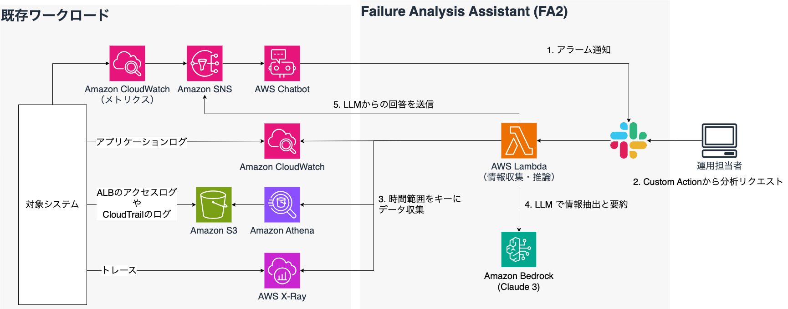

1. 対象システムで、メトリクスなどに設定したアラームが発火し、Amazon SNS と AWS Chatbot を通じ Slack に通知が届きます
2. FA2 をターゲットに設定した Custom Action を実行し、`ログの取得時間範囲`と`アラームからわかるイベント情報`を入力し、リクエストします
3. FA2 は Lambda 上で実行され、リクエストに含まれたログの取得時間範囲から、定義されたログ検索対象にアクセスし、情報を収集します
   1. 以降で設定するパラメータによって、検索対象が決まります。CloudWatch Logs のロググループが必須で、Amazon Athena や AWS X-Ray はオプションとなります
   2. 検索対象を増やすことで、より精度の高い回答を得られる可能性があります
4. FA2 に含まれるプロンプトテンプレートに、収集した情報をコンテキストとして加え、プロンプトを作成します。そのプロンプトを Amazon Bedrock に送り、イベントに関連した情報の要約やイベントの原因分析に必要な情報抽出を行います
5. LLM から得られた回答を返すため、SNS トピックに回答内容を送信し、AWS Chatbot を通じ、Slack に送ります

## 前提条件

- AWS Cloud Development Kit (CDK) が利用できること
  - 本サンプルは CDK で実装されています
- 分析したいログが含まれている、CloudWatch Logs のロググループがあること
  - Amazon Athena や AWS X-Ray は任意の設定項目となります
  - AWS CloudTrail、Application Load Balancer (ALB) のアクセスログを利用する場合、Amazon Athena のデータベースが作成されていること
  - AWS X-Ray のトレース情報も利用する場合、該当システムの AWS X-Ray トレースが取得できていること
- Amazon Bedrock でモデルアクセスから、Claude 3 Sonnet, Claude 3.5 Sonnet のアクセス許可をしていること
  - Claude 3.5 Sonnet は、Mermaid記法で画像による障害原因の仮説を図示するために利用します
- 既存ワークロードで設定した AWS Chatbot から Slack にアラームの通知が来ることを確認していること
  - FA2 のテスト利用のための既存ワークロードがない、もしくは利用できない場合、[FA２のお試し環境の作り方](./docs/HowToCreateTestEnvironment.md)を参考に、環境を作ることもできます

## How to Deploy

### パラメータ設定

次の記載を参考に、`parameter_template.ts`をコピーし、`parameter.ts` を作成した上で、それぞれの値を変更してください。

例: AWS Chatbot 版で、 Claude 3 Sonnet を利用し、CloudWatch Logs、Athena、X-Ray、を検索対象とした場合の設定です。

```json
export const devParameter: AppParameter = {
  env: {
    account: "123456789012",
    region: "us-east-1",
  },
  language: "ja",
  envName: "Development",
  modelId: "anthropic.claude-3-sonnet-20240229-v1:0",
  topicArn:
    "arn:aws:sns:us-east-1:123456789012:ExampleTopic",
  architectureDescription: "あなたが担当するワークロードは、CloudFront、ALB、ECS on EC2、DynamoDBで構成されており、ECS on EC2上にSpringアプリケーションがデプロイされています。",
  cwLogsLogGroups: [
    "ApiLogGroup", "/aws/ecs/containerinsights/EcsAppCluster/performance"
  ],
  cwLogsInsightQuery: "fields @message | limit 100",
  databaseName: "athenadatacatalog",
  albAccessLogTableName: "alb_access_logs",
  cloudTrailLogTableName: "cloud_trail_logs",
  xrayTrace: true,
  insight: true,
  findingsReport: true,
  detectorId: "xxxxxxxxxxxxxxx"
};
```

#### パラメータの説明

| パラメータ               | 値の例                                                                    | 概要                                                                                                                                                                       |
| ------------------------ | ------------------------------------------------------------------------- | -------------------------------------------------------------------------------------------------------------------------------------------------------------------------- |
| `env.account`            | `"123456789012"`                                                          | デプロイ先 AWS アカウントのアカウント ID                                                                                                                                   |
| `env.region`             | `"us-east-1"`                                                             | デプロイ先リージョン                                                                                                                                                       |
| `language`               | `"ja"`                                                                    | プロンプトや UI の言語設定。`en` または `ja` のどちらかを指定します                                                                                                        |
| `envName`                | `"Development"`                                                           | 環境名。`Development` や `Staging` など                                                                                                                                    |
| `modelId`                | `"anthropic.claude-3-sonnet-20240229-v1:0"`                               | Amazon Bedrock で定義されたモデル ID を指定します。モデルアクセスで許可しているものを指定してください                                                                      |
| `topicArn`               | `"arn:aws:sns:us-east-1:123456789012:ExampleTopic"`                       | AWS Chatbot にイベントを渡している Amazon SNS の Topic の ARN。ClientType が `AWSCHATBOT` の場合必須です                                                                   |
| `architectureDescription`  | `"あなたが担当するワークロードは、CloudFront、ALB、ECS on EC2、DynamoDBで構成されており、ECS on EC2上にSpringアプリケーションがデプロイされています。"`                                                     | 　障害分析の対象となるシステムを説明する文章です。プロンプトに組み込まれますので、AWSのサービス名や要素技術を含める、簡潔にする、などを心がけてください。                                                                            |
| `cwLogsLogGroups`        | `["ApiLogGroup", "/aws/ecs/containerinsights/EcsAppCluster/performance"]` | ログを取得したい Amazon CloudWatch Logs のロググループを指定します。最大 50 個まで指定可能です                                                                             |
| `cwLogsInsightQuery`     | `"fields @message \| limit 100"`                                          | CloudWatch Logs Insight で利用したいクエリを指定します。コンテキストウィンドウとの兼ね合いから、デフォルトでは、100 件に制限する（実際のプロンプトに応じて、調整ください） |
| `databaseName`           | `"athenadatacatalog"`                                                     | Amazon Athena のデータベース名。Athena を使ってログ検索を行いたい場合は必須です                                                                                            |
| `albAccessLogTableName`  | `"alb_access_logs"`                                                       | ALB のアクセスログのテーブル名。今回のサンプルでは、Athena で ALB のアクセスログのログ検索を実装したため、利用する場合 ALB のアクセスログテーブル名を指定します            |
| `cloudTrailLogTableName` | `"cloud_trail_logs"`                                                      | AWS CloudTrail のログのテーブル名。今回のサンプルでは、Athena で CloudTrail の監査ログのログ検索を実装したため、利用する場合 CloudTrail のログテーブル名を指定します       |
| `xrayTrace`              | `true`                                                                    | 分析対象に AWS X-Ray のトレース情報を含めるかどうか決めるためのパラメータ                                                                                                  |
| `insight`              | `true`                                                                    | メトリクス分析支援を利用する場合には、 `true` を設定してください                                                                                                       |
| `findingsReport`              | `true`                                                                    |  Findings レポートを利用するには、 `true` を設定してください                                                                                                       |
| `detectorId`              | `"xxxxxxxxxxx"`                                                                    | `findings-report` を利用する場合には必須です。アカウントで定義されている `detectorId` を設定してください                                                                                                       |

#### プロンプトの変更

`lambda/lib/prompts.ts` にそれぞれの推論で利用するプロンプトが記載されています。
それぞれのプロンプトでは、`parameter.ts` にある、`architectureDescription` を使って、対象となるワークロードのアーキテクチャの説明文を取得しています。
ご自身が FA2 をデプロイする環境に合わせ、このアーキテクチャの説明文を変更してください。

また、デプロイ後のテストで、期待した結果が得られない場合は、`createFailureAnalysisPrompt` 関数に記載されているプロンプトをチューニングしてください。

### CDK デプロイ

まず、障害原因の仮説を図示する機能でLambda関数のLayerが必要となります。
そこで、最初にLayerに必要なモジュールをインストールするコマンドを実行してください。
続いて、通常のCDKのデプロイのコマンドを実施します。

```bash
$ npm run build:layer // 障害原因の仮説を図示する機能を利用するために実施します
$ npm install
$ npx cdk bootstrap --profile {your_profile}
$ npx cdk deploy --all --profile {your_profile} --require-approval never
```

> [!NOTE]
> `failure-analysis-assistant/lambda/functions/fa2-lambda/main.mts` の、`// Additional process.`の記載から始まる箇所が、障害原因の仮説の図を生成する処理になります。
> 図の生成が不要の場合、この部分はコメントアウトまたは削除してください。

### Custom Action の設定

1. CDK デプロイ後に、デプロイした Lambda 関数の名前を確認してください
2. AWS Chatbot の通知にある、３点リーダをクリックします

   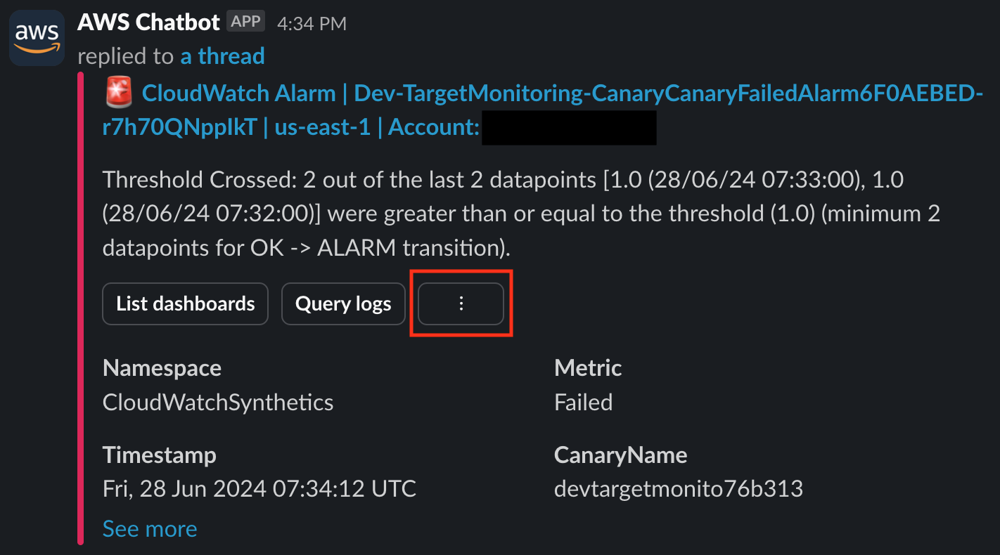

3. [Create a new custom action button] の [Create] をクリックします

   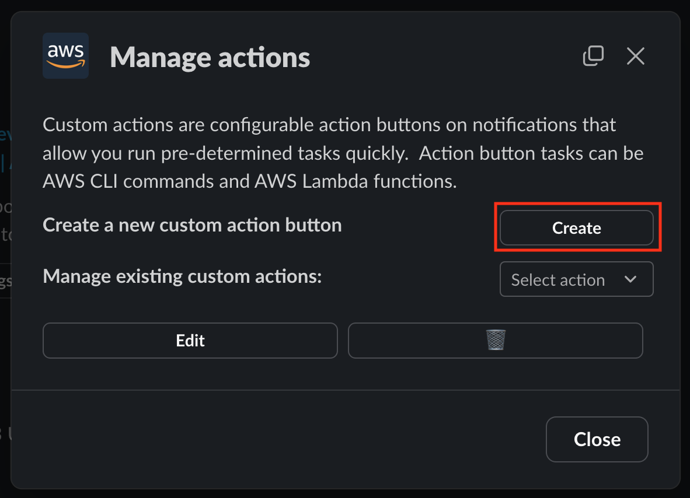

4. [Custom action name] に [FA2] 、 [Custom action button text] と [FA2] とそれぞれ入力し、 [Custom action type] では [CLI action] を選択し [Next] をクリックします

   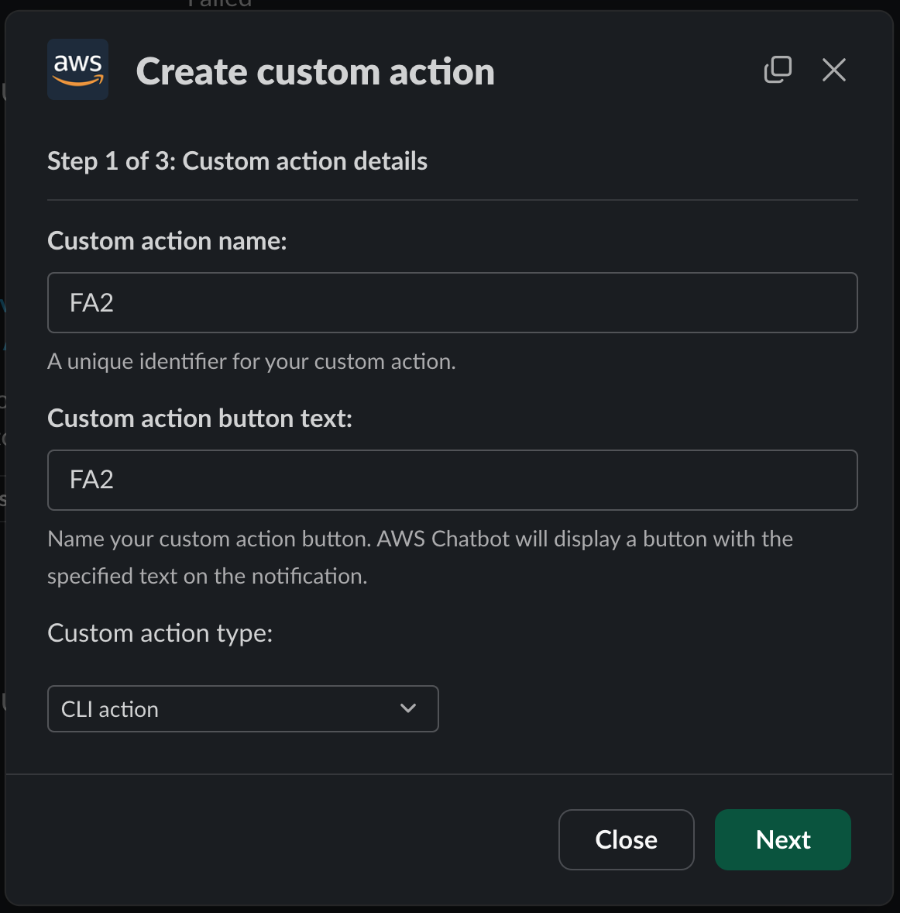

5. [Define CLI command] に以下のスクリプトの Lambda 関数名とリージョンをデプロイしたものに書き換えた上で、コピー＆ペーストします

   ```bash
   lambda invoke --function-name {デプロイしたLambda関数の名前} --payload {
     "startDate" : "$startDate",
     "endDate": "$endDate",
     "errorDescription": "$errorDescription",
     "alarmName": "$MetricAlarmName",
     "alarmTimestamp": "$Timestamp"
   } --region {デプロイ先リージョン} --invocation-type Event
   ```

   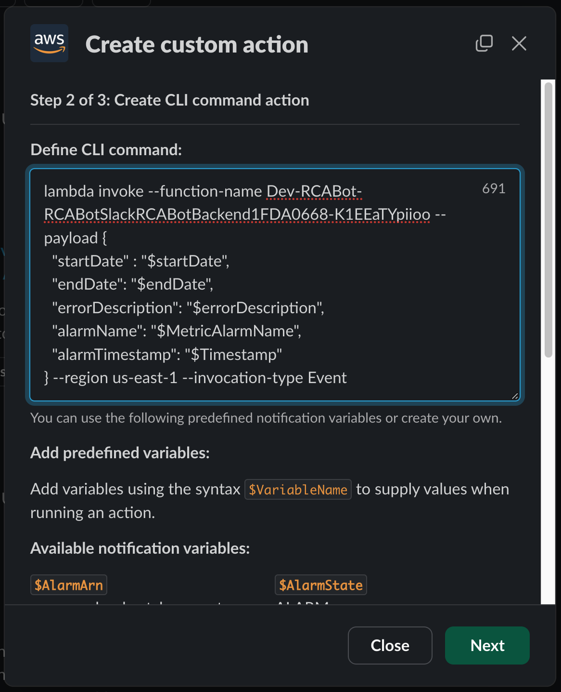

6. [Display criteria] は変更せず、そのまま [Save] をクリックします
   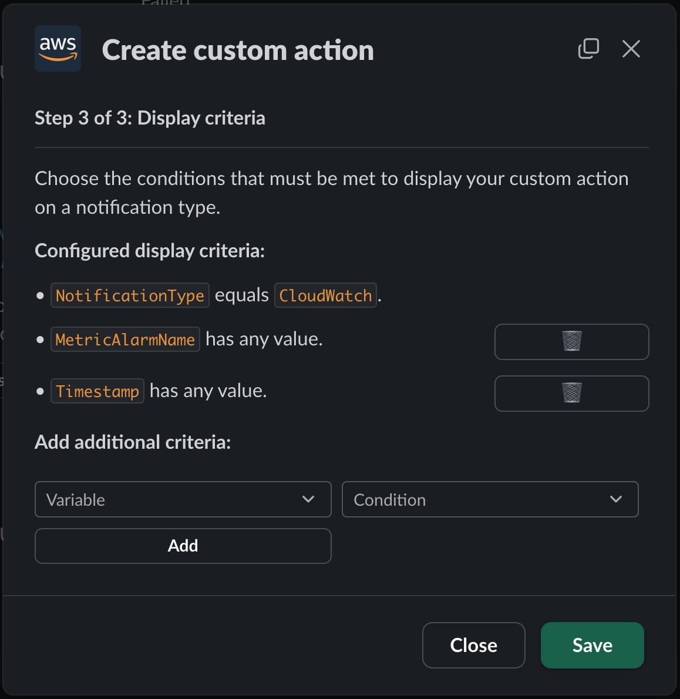

7. **AWS Chatbot が次から送信する通知**には、作成した [FA2] の Custom Action がボタンとして表示されます
   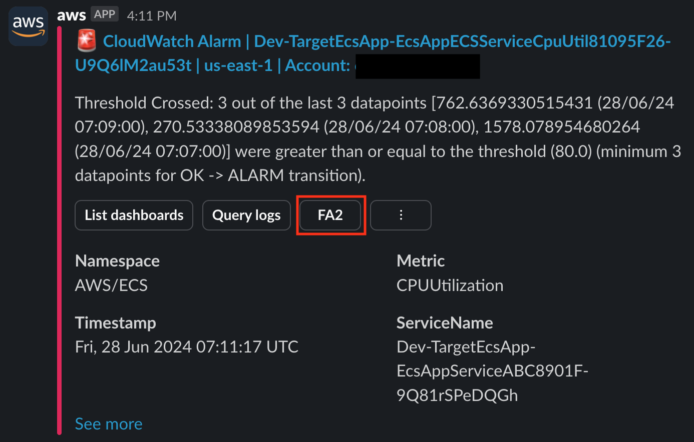

### [オプション]メトリクス分析支援機能のための Command Alias の設定

メトリクス分析支援を利用する場合は、Lambda の呼び出しを簡略化するため、AWS Chatbot の Command Alias 機能を利用します。
AWS Chatbot が導入されているチャンネルのチャット欄に、以下を入力します。

```bash
@aws alias create insihgt lambda invoke --function-name {メトリクス分析支援を提供する Lambda 関数名} --payload { "query" : $query, "duration": $duration } --region {関数をデプロイしたリージョン} --invocation-type Event
```

### [オプション]Findings レポート機能のための Custom Action の設定

Findings レポートを利用する場合は、Lambda の呼び出しを簡略化するため、AWS Chatbot の Command Alias 機能を利用します。
AWS Chatbot が導入されているチャンネルのチャット欄に、以下を入力します。

```bash
@aws alias create findings-report lambda invoke --function-name {メトリクス分析支援を提供する Lambda 関数名} --region {関数をデプロイしたリージョン} --invocation-type Event
```

### テスト

#### 障害分析支援

1. 表示されたアラームの中にある [FA2] ボタンをクリックします
2. フォームが表示されるので、次の画像のように入力します

   1. `startDate`, `endDate`はそれぞれ`ISO 8601`の形式で`UTC`で入力します (`ISO 8601` 形式: yyyy-mm-ddThh:mm:ssZ)
   2. `errorDescription` は、アラームの概要を入力します
   3. `alarmName`と`alarmTimestamp`はそのままで、[Next]をクリックします

      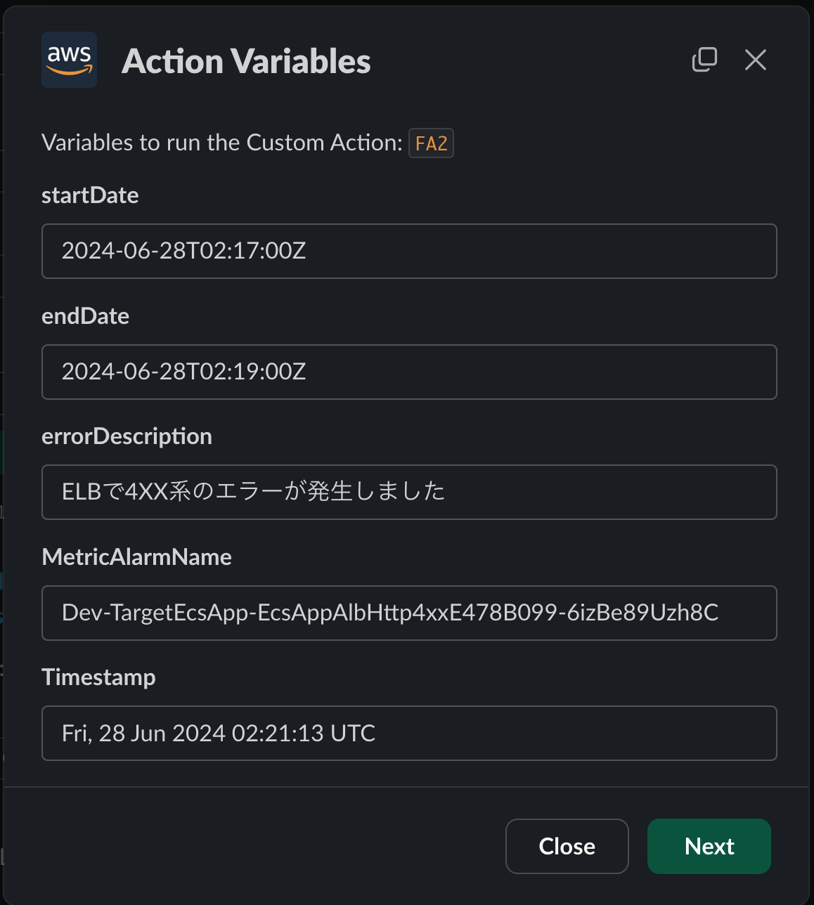

3. 入力内容の確認がされるので、[Run]をクリックします

   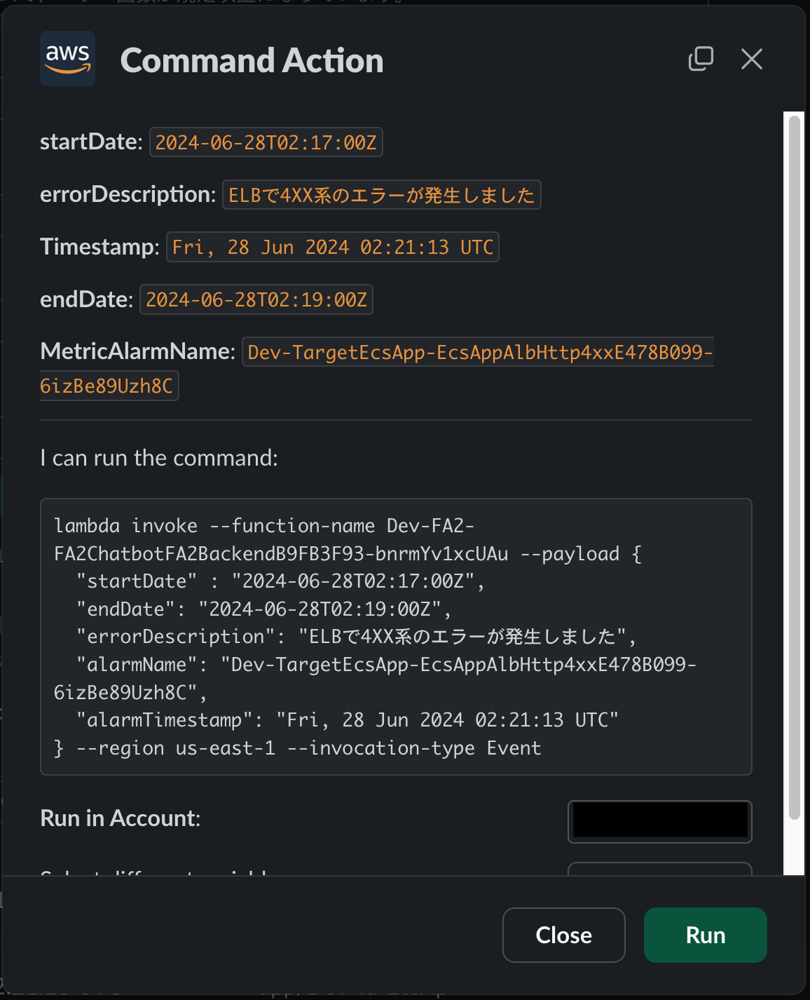

4. リクエストが受け付けられると、スレッドに次のような返信が返ります

   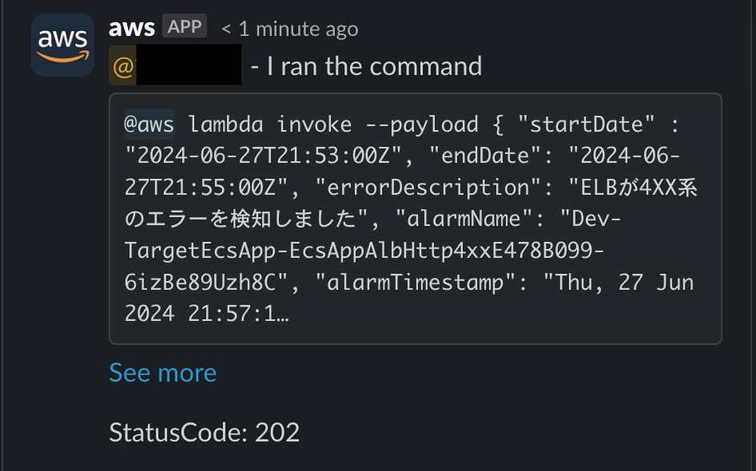

5. 少し時間が経つと、Slack へ回答が返ります

   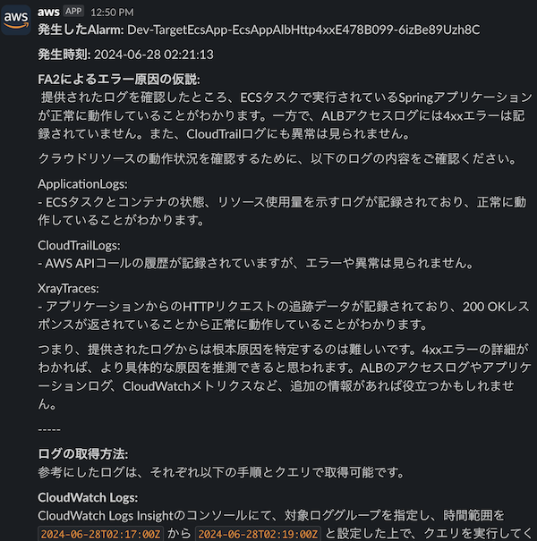

#### [オプション]メトリクス分析支援

AWS Chatbot が導入されているチャンネルのチャット欄に、以下を入力します。

```bash
@aws run insight --query ""ECSのリソースは十分ですか？チューニングの必要はありますか？"" --duration 14
```

> NOTE
> `--query` に渡す文字列を囲うダブルクオーテーションは、例のように二重にする必要があります。

入力が受け付けられると、次のようなメッセージが表示されます。


実行が完了すると、次の画像のように分析結果が表示されます。


#### [オプション]Findings レポート機能

AWS Chatbot が導入されているチャンネルのチャット欄に、以下を入力します。

```bash
@aws run findings-report
```

入力が受け付けられると、次のようなメッセージが表示されます。


実行が完了すると、次の画像のようにレポートのダウンロード URL が表示されます。
ダウンロード URL は、デフォルトでは 1 時間です。ダウンロードし、レポートの中身をご確認ください。


## リソースの削除

以下のコマンドを実行し、デプロイしたリソースを削除してください。

```bash
$ npx cdk destroy --profile {your_profile}
```

## 注意事項

本ソースコードはサンプルのため、Amazon API Gateway に対し、AWS WAF をアタッチしていません。
Slack のエンドポイントはパブリックに公開されているため、攻撃対象となる可能性があります。
本番利用される際は、セキュリティリスク軽減のため、AWS WAF のご利用を検討してください。

## Amazon Bedrock 利用に向けた検討事項

Amazon Bedrock では、モデルへのアクセスのログを取得することができます。
ログを取得したい場合、[モデル呼び出しのログ記録](https://docs.aws.amazon.com/ja_jp/bedrock/latest/userguide/model-invocation-logging.html)を参考に、ログの設定を行ってください。

また、Amazon Bedrock のモデルの入出力をフィルタリングすることも可能です。
ログに機密情報が含まれる場合、[Amazon Bedrock のガードレール](https://docs.aws.amazon.com/ja_jp/bedrock/latest/userguide/guardrails.html)を用いて、モデルへの入出力をフィルタリングできますので、合わせてご検討ください。

## Security

See [CONTRIBUTING](CONTRIBUTING.md#security-issue-notifications) for more information.

## License

This library is licensed under the MIT-0 License. See the LICENSE file.
