# Failure Analysis Assistant (FA2) AWS Chatbot Custom Action version

[日本語で読む](./README.md)

This is a sample implementation that responds to alarms sent to Slack by AWS Chatbot and helps analyze the root cause of the failure.
Logs are retrieved from a predefined log storage location within a time range specified by the user, information is extracted and summarized with LLM, and information useful for failure analysis is returned to Slack.

This README introduces an implementation using **AWS Chatbot's Custom Action.**
If you want to check the Slack App version that was shown at the AWS Summit Japan 2024, go to [Failure Analysis Assistant (FA2) Slack App version](https://github.com/aws-samples/failure-analysis-assistant).

## Architecture & Workflow

The scope of existing workloads is based on the assumption that you have already been implemented.
You can try this sample if the log is output to Amazon CloudWatch Logs. Amazon S3 and AWS X-Ray are optional.

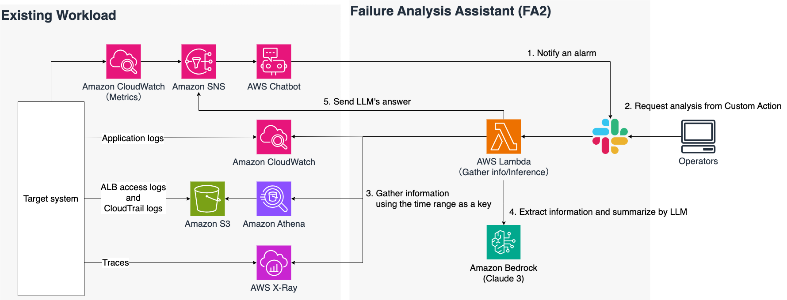

1. Alarms are triggered on the target system, and notifications are sent to Slack via Amazon SNS and AWS Chatbot
2. Execute a custom action with FA2 as the target, enter `log retrieval time range` and `event information understood from alarms`, and submit a request
3. FA2 runs on AWS Lambda and accesses you defined log search targets and collects information from the log retrieval time range included in the request
   1. The parameters you set determine what to search for. A log group of Amazon CloudWatch Logs is required; database of Amazon Athena, and the parameter of AWS X-Ray are optional
   2. By increasing the number of search targets, there is a possibility that more accurate answers can be obtained
4. The collected information is added as context to the prompt template included in FA2 and sent to Amazon Bedrock to summarize information related to the event and extract information necessary for event cause analysis
5. In order to return answers obtained from LLM, submit answers to existed SNS topics and send them to Slack via AWS Chatbot

## Requirements

- You can use the AWS Cloud Development Kit (CDK)
  - This sample is implemented in CDK
- You must have a CloudWatch Logs log group containing the logs you want to analyze
  - Amazon Athena and AWS X-Ray are optional
  - If you want to invlude AWS CloudTrail or Application Load Balancer (ALB) access logs, an Amazon Athena database must be created
  - If AWS X-Ray trace information is also used, an AWS X-Ray trace for the relevant system must have been obtained
- Claude v3 Sonnet access has been granted from model access on Amazon Bedrock
- Confirm that an alarm notification will be sent to Slack from the AWS Chatbot set up in the existing workload
  - If you don't have the test envrionment for FA2 or you cannot use it for FA2. You can create test environment as follow [How to create a test environment for FA2](./docs/HowToCreateTestEnvironment_en.md).

## How to Deploy

### Setting parameters

Refer to the following description, copy `parameter_template.ts`, create `parameter.ts`, and then change each value.

```
// Example: Settings for the AWS Chatbot version when using Claude 3 Sonnet and using CloudWatch Logs, Athena, and X-Ray as search targets
export const devParameter: AppParameter = {
  env: {
    account: "123456789012",
    region: "us-east-1",
  },
  language: "ja",
  envName: "Development",
  clientType: "AWSCHATBOT",
  modelId: "anthropic.claude-3-sonnet-20240229-v1:0",
  cwLogsLogGroups: [
    "ApiLogGroup", "/aws/ecs/containerinsights/EcsAppCluster/performance"
  ],
  cwLogsInsightQuery: "fields @message | limit 100",
  databaseName: "athenadatacatalog",
  albAccessLogTableName: "alb_access_logs",
  cloudTrailLogTableName: "cloud_trail_logs",
  xrayTrace: true,
  topicArn:
    "arn:aws:sns:us-east-1:123456789012:ExampleTopic",
};
```

#### Explanation of parameters

| Parameters               | Example value                                                             | Description                                                                                                                                                                                 |
| ------------------------ | ------------------------------------------------------------------------- | ------------------------------------------------------------------------------------------------------------------------------------------------------------------------------------------- |
| `env.account`            | `"123456789012"`                                                          | AWS Account ID to deploy this sample                                                                                                                                                        |
| `env.region`             | `"us-east-1"`                                                             | AWS Region to deploy this sample                                                                                                                                                            |
| `language`               | `"ja"`                                                                    | Language setting for prompt and UI. Choose one, `en` or `ja`.                                                                                                                               |
| `envName`                | `"Development"`                                                           | Environment name.                                                                                                                                                                           |
| `clientType`             | `"AWSCHATBOT"`                                                            | Client type you required. Choose `AWSCHATBOT` is in case of AWS Chatbot version.                                                                                                            |
| `modelId`                | `"anthropic.claude-3-sonnet-20240229-v1:0"`                               | Put the model ID of Amazon Bedrock you want to use. Please check access grants of chosen model.                                                                                             |
| `cwLogsLogGroups`        | `["ApiLogGroup", "/aws/ecs/containerinsights/EcsAppCluster/performance"]` | Specify the log group of Amazon CloudWatch Logs for which you want to retrieve logs. Up to 50 can be specified.                                                                             |
| `cwLogsInsightQuery`     | `"fields @message \| limit 100"`                                          | Specify the query you want to use with CloudWatch Logs Insight. Due to balance with the context window, the default limit is 100 (please modify the query according to actual environment). |
| `databaseName`           | `"athenadatacatalog"`                                                     | The name of the Amazon Athena database. Required if you want to use Athena to search logs.                                                                                                  |
| `albAccessLogTableName`  | `"alb_access_logs"`                                                       | ALB access log table name. In this sample, ALB access log search was implemented in Athena, so the ALB access log table name is specified when using it.                                    |
| `cloudTrailLogTableName` | `"cloud_trail_logs"`                                                      | AWS CloudTrail log table name. In this sample, we implemented a CloudTrail audit log log search in Athena, so specify the CloudTrail log table name when using it.                          |
| `xrayTrace`              | `true`                                                                    | A parameter for deciding whether to include AWS X-Ray trace information in the analysis                                                                                                     |
| `topicArn`               | `"arn:aws:sns:us-east-1:123456789012:ExampleTopic"`                       | The ARN of the Amazon SNS topic that is handing events to AWS Chatbot. Required if clientType is `AWSCHATBOT`                                                                               |

### Deployment

Follow below instruction,

```
$ npm install
$ npx cdk bootstrap --profile {your_profile}
$ npx cdk deploy --all --profile {your_profile} --require-approval never
```

### Configuration for Custom Action

1. After deploying the CDK, check the name of the deployed Lambda function
2. Click the 3-point reader on the AWS Chatbot notification

   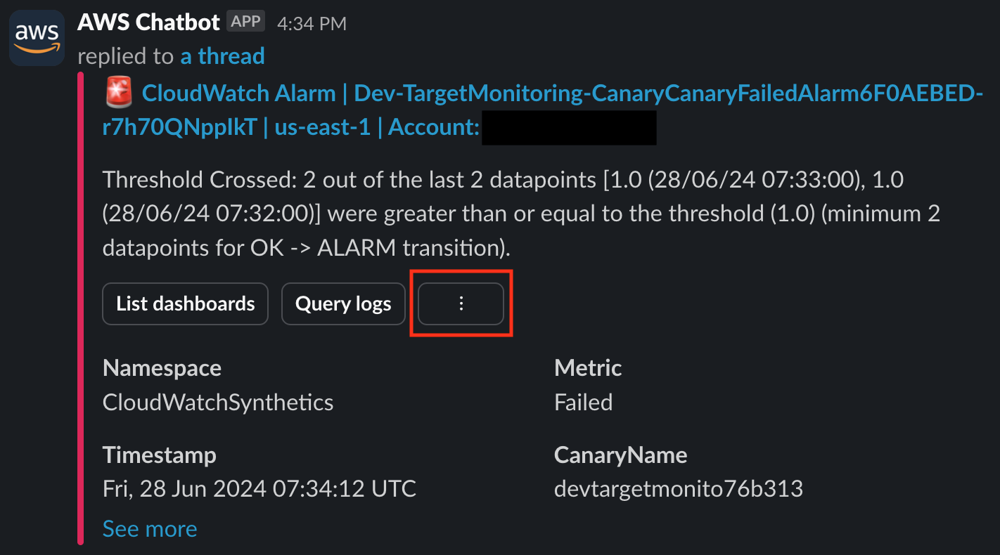

3. Click [Create] button in [Create a new custom action button] section

   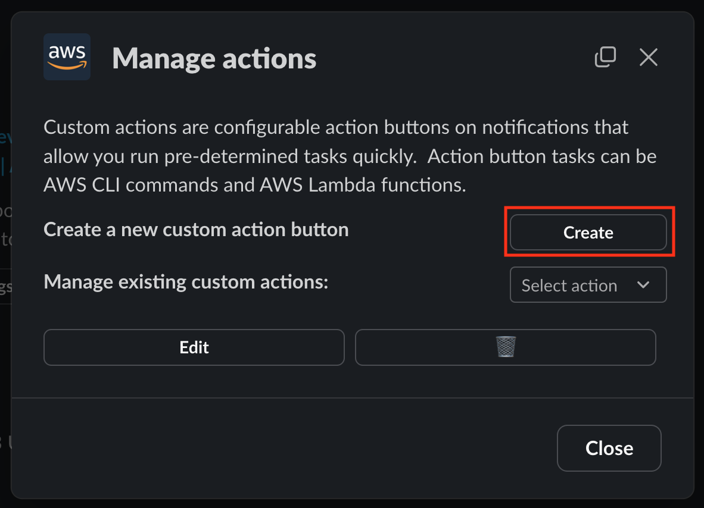

4. Input [FA2] to [Custom action name], and [Custom action button text], and choose [CLI action] from [Custom action type] list, finally, click [Next] button

   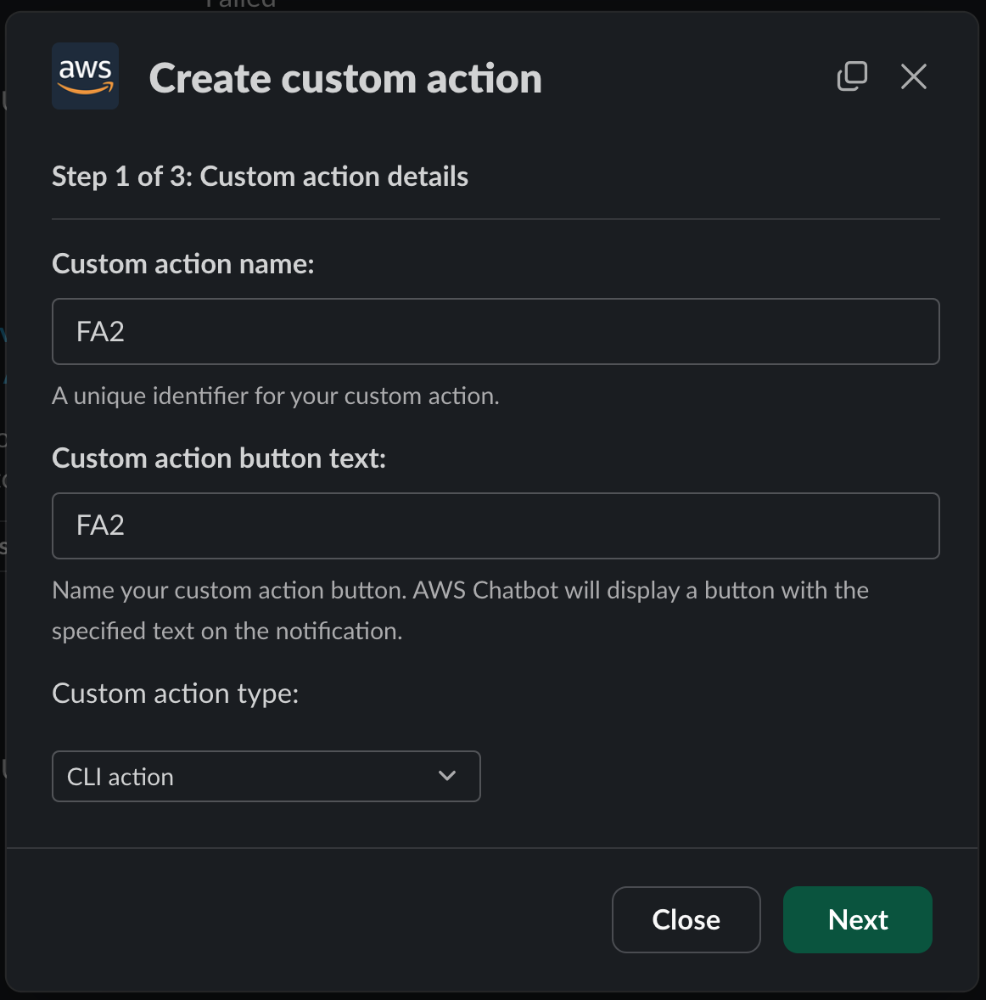

5. Update below script {Deployed lambda function name} and {Deploy region}, and put it to [Define CLI command].
   ```
   lambda invoke --function-name {Deployed lambda function name} --payload {
     "startDate" : "$startDate",
     "endDate": "$endDate",
     "errorDescription": "$errorDescription",
     "alarmName": "$MetricAlarmName",
     "alarmTimestamp": "$Timestamp"
   } --region {Deploy region} --invocation-type Event
   ```
   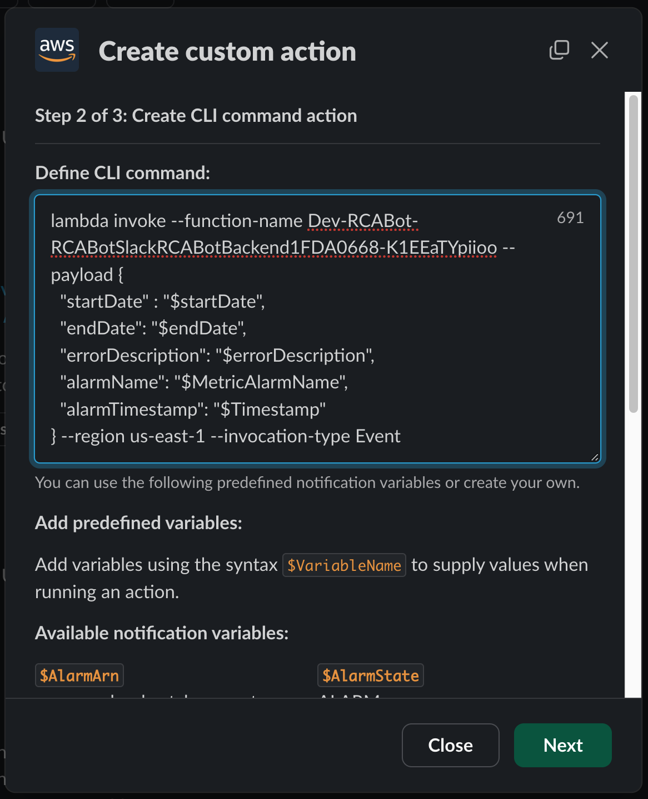
6. No change in [Display criteria], continue to proceed. Click [Save] button.
   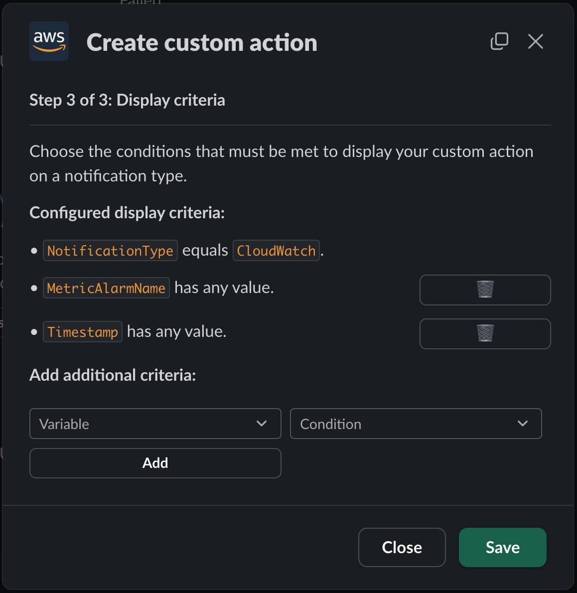
7. **The next notification that AWS Chatbot will send** will display the created [FA2] custom action as a button
   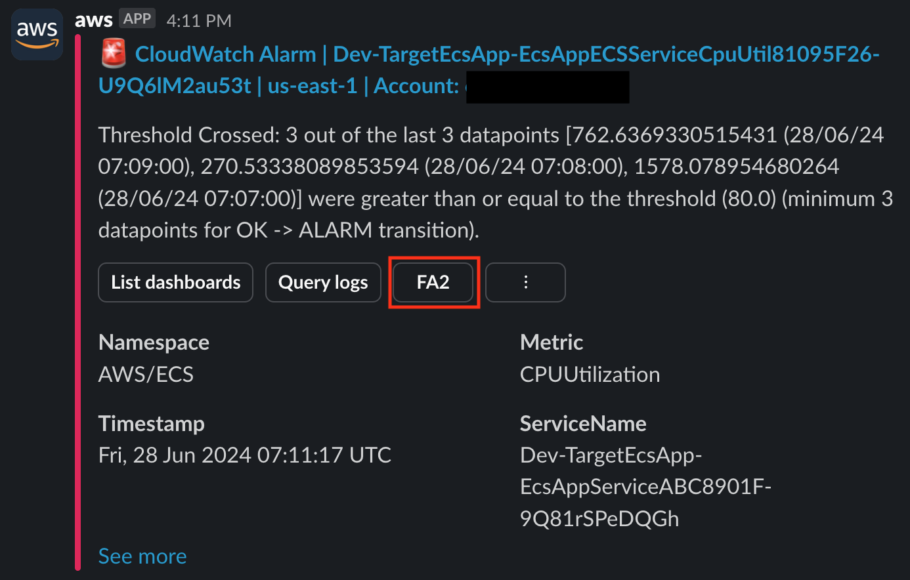

## Testing

1. Click [FA2] button in an alarm.
2. Input some values followed below instruction:

   1. Input in `UTC` in `ISO 8601` format (`ISO 8601` format: yyyy-mm-ddTHH: mm:ssZ) to `startDate` and `enddate`.
   2. Enters an overview of the alarm to `errorDescription`
   3. Leave `alarmName` and `alarmTimeStamp` as they are, and click [Next]

      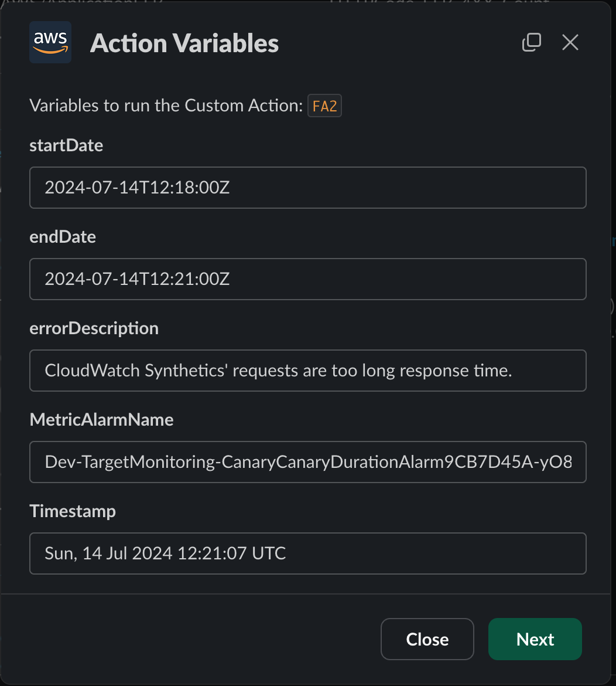

3. Check the input values. If it's OK, click [Run] button

   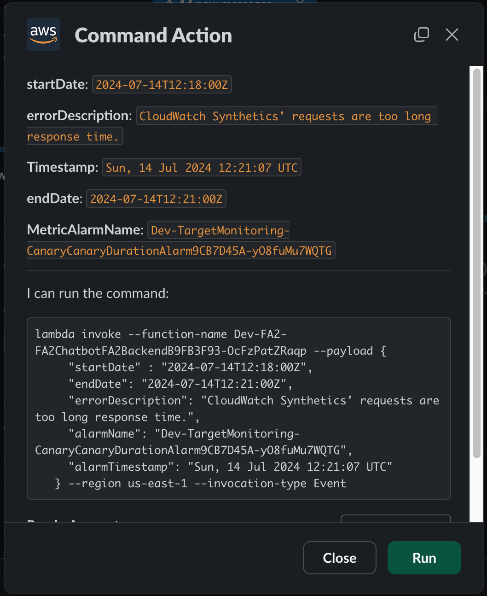

4. You will receive below response after request is success

   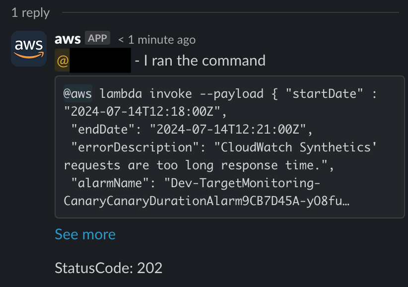

5. Please wait a few minutes. FA2 will send response

   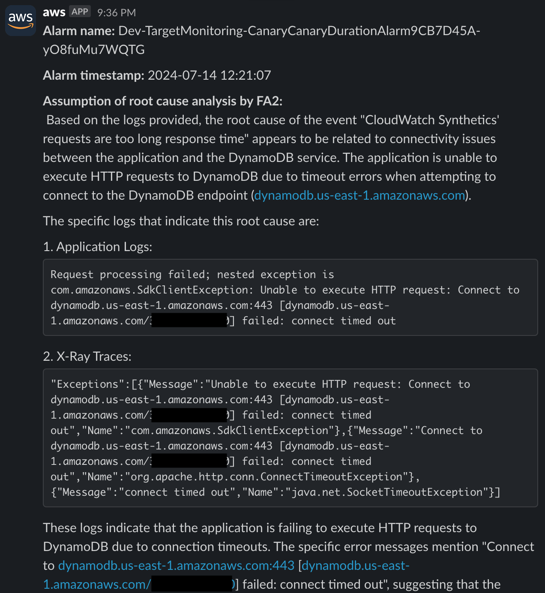

## Delete deployed resources

Please delete resources you deployed by this command.

```
$ npx cdk destroy --profile {your_profile}
```

## Considerations for using Amazon Bedrock

Amazon Bedrock allows you to obtain a log of model accesses.
If you want to get a log, go to [Model invocation logging](https://docs.aws.amazon.com/bedrock/latest/userguide/model-invocation-logging.html) and configure the logging of model invocation.

And, you can filter input and output of the models of Amazon Bedrock.
If the logs contain sensitive information, you can use [Guardrails for Amazon Bedrock](https://docs.aws.amazon.com/bedrock/latest/userguide/guardrails.html) to filter input and output to the model, so please consider that as well.

## Security

See [CONTRIBUTING](CONTRIBUTING.md#security-issue-notifications) for more information.

## License

This library is licensed under the MIT-0 License. See the LICENSE file.
