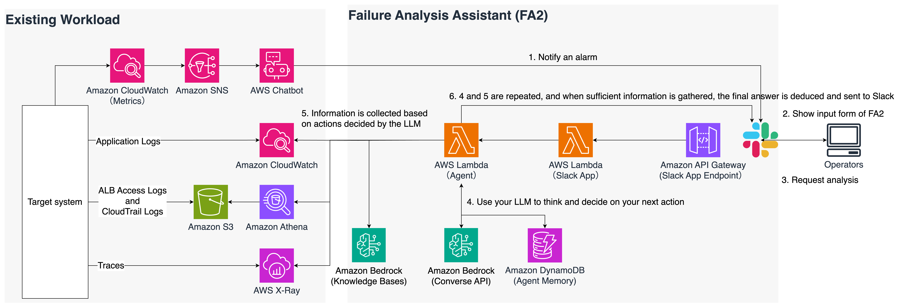

# Failure Analysis Assistant (FA2) Slack App Version

[日本語で読む](./README.md)

This is a sample implementation that responds to alarms sent to Slack by Amazon Q Developer in chat applications and helps analyze the root cause of the failure.
This is the sample code for the demo shown at the AWS Summit Japan 2024 booth.
This sample code provides the following feature:

**Failure analysis assist**

Logs are retrieved from a predefined log storage location within a time range specified by the user, information is extracted and summarized with LLM, and information useful for failure analysis is returned to Slack.
For an example of how the function works, see [Failure Analysis Assist](#failure-analysis-assist).

## Branches

- [`main`](https://github.com/aws-samples/failure-analysis-assistant) - This branch. This version uses the Slack App. This was exhibited at the AWS Summit Japan 2024.
- [`chatbot-customaction`](https://github.com/aws-samples/failure-analysis-assistant/tree/chatbot-customaction) - Instead of the Slack App, this is a version that implements an input form using a `Custom Action` of Amazon Q Developer in chat applications. If you don't have an environment where you can't use the Slack App, or if you don't want to manage the Slack App, use this.

## Background

I think there are many people who have implemented ChatOps to send alarm notifications to the chat applications.
However, when an event such as an alarm occurs, what actually takes time is root cause analysis and correction after identification of analysis results, which occurs after the event is detected.
This sample shows failure analysis using LLM as one idea to make cause analysis as efficient as possible.

Normally, when you analyses root cause, you aquired logs after defining a fixed period of time from the time the alarm occurred using empirical rules.
The logs are not in one place, and there are in many places. After collecting logs from all places, we organize their dependencies, and identify the root cause.

This process is so hard task that requires patience and time, and pressure will be applied in situations in the case of happening the negative impact to your business.
Amazon CloudWatch Logs, which is a typical log output location for AWS, has an API for querying, so if you have specific time range, you can retrieve logs. we can retrieve the logs from Amazon S3 that is combined with Amazon Athena in similar way.
Additionally, by specifying a time range, AWS X-Ray can also obtain trace information for that time range.

From the above, it is possible to automate the retrieval of logs and traces programmatically.
And, we inputted the acquired information into a large language model (LLM) to improve the efficiency of information extraction and summarization.

LLM is known for its ability to handle summaries and information extraction. It is possible to process more input information in a faster time than humans.
There is a possibility that hallucination will be included in LLM response, so caution is necessary, but I think it can be used as an auxiliary way for humans to make decisions in the end.

Please use this sample and try out the effects.

## Architecture & Workflow

The scope of existing workloads is based on the assumption that you have already been implemented.
You can try this sample if the log is output to CloudWatch Logs. S3 and X-Ray are optional.



1. Alarms are triggered on the target system, and notifications are sent to Slack via Amazon SNS and Amazon Q Developer in chat applications
2. Show the input form of Slack App when it received an alarm
3. Enter `log retrieval time range` and `event information understood from alarms`, and submit a request
4. FA2 runs on AWS Lambda and uses an agent based on the ReACT (Reasoning + Acting) algorithm to perform failure analysis:
   1. **Thinking Step**: The agent analyzes the situation and decides what action to take next
   2. **Acting Step**: The agent executes the decided tool (e.g., retrieving logs from CloudWatch Logs, analyzing metrics)
   3. **Observing Step**: The agent observes the results of the tool execution and collects new information
   4. **Cycle Repetition**: The agent repeats the thinking→acting→observing cycle until sufficient information is gathered
   5. **Result Generation Phase**: The agent generates a final failure analysis report based on the collected information
5. The agent uses the following tools to collect and analyze information:
   - **metrics_tool**: Retrieves and analyzes CloudWatch metrics
   - **logs_tool**: Retrieves and analyzes logs from CloudWatch Logs
   - **audit_log_tool**: Retrieves and analyzes audit logs from CloudTrail
   - **xray_tool**: Retrieves and analyzes trace information from X-Ray
   - **kb_tool**: Searches documents from Knowledge Base
6. When the analysis is complete, the agent generates a detailed failure analysis report that includes:
   - Issue summary
   - Root cause (with severity and confidence levels)
   - Referenced logs/metrics
   - Timeline analysis
   - Recommended actions
   - Prevention measures
7. The generated report is sent to Slack and provided to the user

### Detailed ReACT Agent Operation

The ReACT agent, which is the core of FA2, operates with the following detailed process:

1. **Session Management**:
   - A unique session ID is generated for each analysis request
   - Session state is stored in DynamoDB and maintained between Lambda function executions
   - Session information includes thinking history, executed tools, collected data, etc.

2. **Thinking Process**:
   - In the initial thinking, the agent develops an analysis strategy based on error content and available tools
   - In subsequent cycles, it decides the next action considering the information collected so far
   - The result of thinking is output in a structured format, and the next action is determined

3. **Tool Execution**:
   - Selected tools are executed with appropriate parameters
   - Execution results are recorded in the session state, and data collection status is updated
   - The results of each tool execution are used as input for the next thinking cycle

4. **Cycle Control**:
   - The maximum number of cycles can be controlled with the `maxAgentCycles` parameter (default: 5)
   - When sufficient information is gathered or the maximum number of cycles is reached, it transitions to the final answer generation phase
   - Appropriate error handling is performed when Bedrock rate limits are reached

5. **Final Answer Generation**:
   - All collected information is integrated to generate a structured failure analysis report
   - The report is sent to Slack in Markdown format and shared as a file

## Requirements

- You can use the AWS Cloud Development Kit (CDK)
  - This sample is implemented in CDK
- You must have a CloudWatch Logs log group containing the logs you want to analyze
  - Amazon Athena and AWS X-Ray are optional
  - If you want to invlude AWS CloudTrail or Application Load Balancer (ALB) access logs, an Amazon Athena database must be created
  - If AWS X-Ray trace information is also used, an AWS X-Ray trace for the relevant system must have been obtained
- Claude 3 Sonnet and Claude 3.5 Sonnet access has been granted from model access on Amazon Bedrock
  - Claude 3.5 Sonnet is used for generation of the image written by Mermaid syntax.
- Confirm that an alarm notification will be sent to Slack from the Amazon Q Developer in chat applications set up in the existing workload
  - If you don't have the test envrionment for FA2 or you cannot use it for FA2. You can create test environment as follow [How to create a test environment for FA2](./docs/HowToCreateTestEnvironment_en.md).
- You must have the permission to register the Slack App to the Slack workspace you want to use.
- Turn on execution logging and access logging.
  - If you didn't turn on, please turn on this setting as follow: [Create an IAM role to log to CloudWatch] and [Add the IAM role in the API Gateway console] in [How do I turn on CloudWatch Logs for troubleshooting my API Gateway REST API or WebSocket API?](https://repost.aws/knowledge-center/api-gateway-cloudwatch-logs)

## How to Deploy

### Registration of Slack App

1. Access to [Slack api](https://api.slack.com/apps) and click [create New App]
2. Select [From scratch], enter an app name, select the workspace you want to use when developing, and then click [Create App]
3. The app you created will be shown in [Slack api](https://api.slack.com/apps). Choose it you created.
4. Click [Basic Information] on the left menu, check [Signing Secret], execute the following command, and register with AWS Secrets Manager
   1. `$ aws secretsmanager create-secret --name slackSigningSecret --secret-string XXXXXXXXXXXXXXXXXXXX --profile {your_profile} `
5. Click [OAuth & Permissions] on the left menu, please add permissons `channels:read`, `chat:write` and `files:write` in [Scopes] section.
6. Click [Install to Workspace] in [OAuth Tokens for Your Workspace] of top of same page to install your Slack App to your workspace.
7. After installing, your browser will be redirected to [OAuth & Permissions] page. You check [Bot User OAuth Token], execute the following command, and register with AWS Secrets Manager
   1. `$ aws secretsmanager create-secret --name slackAppToken --secret-string xxxx-111111111111111-11111111111111111-xxxxxxxxxxxxxxxxxxxxxxxxx-profile {your_profile} `

### Setting parameters

Refer to the following description, copy `parameter_template.ts`, create `parameter.ts`, and then change each value.

```
// Example: Settings for the Slack App version when using Claude 3.7 Sonnet and using CloudWatch Logs as search targets
export const devParameter: AppParameter = {
  env: {
    account: "148991357402",
    region: "us-west-2",
  },
  language: "ja",
  envName: "Development",
  modelId: "us.anthropic.claude-3-7-sonnet-20250219-v1:0",
  slackAppTokenKey: "SlackAppToken",
  slackSigningSecretKey: "SlackSigningSecret",
  architectureDescription: "The workload you are responsible for consists of ALB, EC2, and Aurora, and Spring applications are deployed on EC2.",
  cwLogsLogGroups: [
    "/ec2/demoapp",
    "/ec2/messages",
    "/aws/application-signals/data",
  ],
  cwLogsInsightQuery: "fields @message | limit 100",
  xrayTrace: false,
  slashCommands: {
    insight: true,
    findingsReport: true
  },
  knowledgeBase: true,
  embeddingModelId: "amazon.titan-embed-text-v2:0",
  maxAgentCycles: 5 // Maximum number of cycles for ReAct agent
};
```

#### Explanation of parameters

| Parameters               | Example value                                                             | Description                                                                                                                                                                                 |
| ------------------------ | ------------------------------------------------------------------------- | ------------------------------------------------------------------------------------------------------------------------------------------------------------------------------------------- |
| `env.account`            | `"148991357402"`                                                          | AWS Account ID to deploy this sample                                                                                                                                                        |
| `env.region`             | `"us-west-2"`                                                             | AWS Region to deploy this sample                                                                                                                                                            |
| `language`               | `"ja"`                                                                    | Language setting for prompt and UI. Choose one, `en` or `ja`.                                                                                                                               |
| `envName`                | `"Development"`                                                           | Environment name.                                                                                                                                                                           |
| `modelId`                | `"us.anthropic.claude-3-7-sonnet-20250219-v1:0"`                               | Specify the model ID as defined in Amazon Bedrock. Please specify what you allow for model access. Please specify a model with a particular focus on output quality. It is used for inference of the cause of failure, etc.                                                                      |
| `slackAppTokenKey`       | `"SlackAppToken"`                                                         | The key name is to get `SlackAppToken` from AWS Secrets Manager. You should use the same key name in [Registration of Slack App](#registration-of-slack-app).                               |
| `slackSingingSecretKey`  | `"SlackSigningSecret"`                                                     | The key name is to get `SlackSigningSecret` from AWS Secrets Manager. You should use the same key name in [Registration of Slack App](#registration-of-slack-app).                          |
| `architectureDescription`  | `"The workload you are responsible for consists of ALB, EC2, and Aurora, and Spring applications are deployed on EC2."`                                                     | This is a sentence explaining the system to failure analysis. It will be incorporated into the prompt, so please try to include AWS service names and element technology, and keep it simple.                           |
| `cwLogsLogGroups`        | `["/ec2/demoapp", "/ec2/messages", "/aws/application-signals/data"]` | Specify the log group of Amazon CloudWatch Logs for which you want to retrieve logs. Up to 50 can be specified.                                                                             |
| `cwLogsInsightQuery`     | `"fields @message \| limit 100"`                                          | Specify the query you want to use with CloudWatch Logs Insight. Due to balance with the context window, the default limit is 100 (please modify the query according to actual environment). |
| `xrayTrace`              | `false`                                                                    | A parameter for deciding whether to include AWS X-Ray trace information in the analysis                                                                                                     |
| `knowledgeBase`              | `true`                                                                    | Set `true` when using Knowledge Base in failure analysis.                                                                                                      |
| `embeddingModelId`              | `"amazon.titan-embed-text-v2:0"`                                                                    | Optional. If you want to customize your knowledge base when using the Knowledge Base. Set up the Embedding Model. In same time, please modify `VectorDimenssion` in `lib/constructs/aurora-serverless.ts`.                                                                                                     |
| `maxAgentCycles`              | `5`                                                                    | Specifies the maximum number of cycles the ReACT agent will execute. Default is 5.                                                                                                      |

#### Modify prompts

Prompts used for each inference are described in `lambda/lib/prompts.ts`.
Each prompt uses `architectureDescription` in `parameter.ts` to obtain a description of the target workload's architecture.
Please change the description of this architecture according to the environment in which you are deploying FA2.

Also, if post-deployment testing does not produce the expected results, tune the prompts described in the `createFailureAnalysisPrompt` function.

### Deployment

First, a Lambda function layer is required for the function of illustrating the hypothesis of the cause of failure.
So, first run the command to install the modules required for Layer.
Next, execute the normal CDK deployment command.

```
$ npm run build:layer // This must be done for the function of illustrating hypotheses about the architecture of the system you are responsible for.
$ npm install
$ npx cdk bootstrap --profile {your_profile}
$ npx cdk deploy --all --profile {your_profile} --require-approval never
```

> [!NOTE]
> The part that begins with the description of `// Additional process` in `failure-analysis-assistant/lambda/functions/fa2-lambda/main.mts` that is the process of generating a hypothetical diagram of the cause of the fault.
> If you don't need to generate a diagram, comment out or delete this part.

### [Optional] Sync datasource of Knowledge Base

When you enabled `knowledgeBase` property, a knowledge base and a datasource are provisioned.
After checking the status of them, you need to upload the related documents to S3 that is a datasource of knowledge base.
By default, there is no data in the Knowledge Base.

#### Configuration of Slack App

1. After deploying the CDK, check the Amazon API Gateway endpoint URL
2. Access to [Slack api](https://api.slack.com/apps), select [Interactivity & Shortcuts] on the left menu of the displayed screen, set [Interactivity] to turn on, and enter the endpoint of Amazon API Gateway in [Request URL](example: https://{API Gateway endpoint}/v1/slack/events)
   1. If the API resource name hasn't changed, it will be /slack/events, as shown in the example
3. Next, click [Event Subscriptions] on the left menu, set [Enable Events] to turn on, then set [Reqeust URL] in the same way as [Interactivity]
4. Open [Subscribe to bot events] on the same screen, click [Add Bot User Event] and add `message.channels`, click [Save Changes]
5. Once you've made it this far, a pop-up prompting you to reinstall will appear at the top of the screen, click on it and reinstall the Slack App on the target channel. Because you modified the permission of Slack App token in step 4.
   1. Or open [OAuth & Permissions], and click [Reinstall to {your workspace name}] to re-install your app.
6. Join the Slack App to the target channel. To add, open the desired channel and click on the channel name. Select [Integrations] and then click [Add an app]. Find FA2 (or the name of the app you have registered) and click the [Add] button. Follow the instructions that appear to install the app.

#### [Optional]Configuration of Slack App for Failure Analysis Assist

By default, failure analysis assist feature is invoked when alarm notification was received.
However, operators may want to use it anytime.
If this is the case, please make the following settings. The fault analysis assist form can now be used with slash commands.

1. Click [Slash Commands] on the left menu, then click [Create New Command]
   1. Enter the values as shown in the table below, and then click Save when you have entered them all

      | item name         | value                         |
      | ----------------- | ----------------------------- |
      | Command           | /fa2                      |
      | Request URL       | same URL                      |
      | Short Description | Invoke FA2 interactively |

2. Click [App Home] on the left menu, check [Allow users to send Slash commands and messages from the messages tab] in [Message tab].
3. Click [OAuth & Permissions] on the left menu, Add `commands` scope in [Scopes] section.

### Testing

#### Failure Analysis Assist

Some kind of error occurred on the target system from which the log was output.
(This time, we used AWS FIS and caused a connection failure from the Amazon ECS container to Amazon DynamoDB.)
Then, the following alarm is displayed on the Slack channel.
(In the example, Amazon CloudWatch Synthetics is used to perform external monitoring, so this error occurs.)


When a notification of the alarm is received, FA2 responds and displays a form like the one below


The alarm displayed earlier is confirmed, and the contents of the alarm and the time range for which the log is to be acquired are inputted to the displayed form.

\*The datapoints shown by Amazon Q Developer in chat applications are expressed in GMT, so please enter the form after converting it to your local time zone.


Clicked the button, requests are accepted.


Wait a few minutes, and the answers will appear in Slack.

<!-- Please place the test execution result image here -->


## Delete deployed resources

Please use below command to delete the resources you deployed

```
$ npx cdk destroy --profile {your_profile}
```

## Considerations

Since this source code is a sample, AWS WAF is not attached to the Amazon API Gateway.
Slack's endpoints are publicly exposed, so they can be targeted by attacks.
For production use, please consider using AWS WAF to reduce security risks.

## Security

See [CONTRIBUTING](CONTRIBUTING.md#security-issue-notifications) for more information.

## License

This library is licensed under the MIT-0 License. See the LICENSE file.
